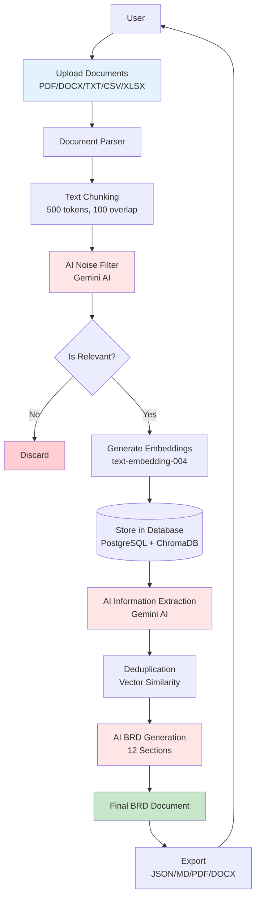
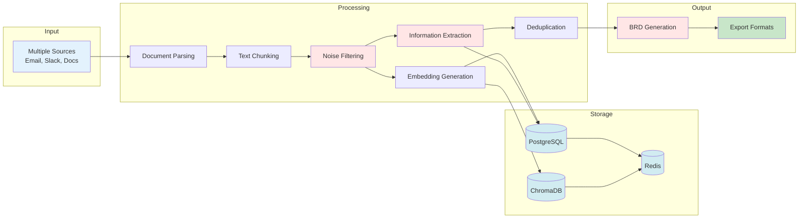
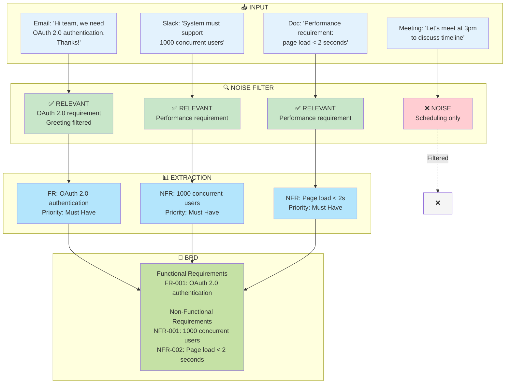

# BRD Generator - Flow Diagrams

## 1. System Flow Diagram

```mermaid
flowchart TD
    User[User] --> Upload[Upload Documents<br/>PDF/DOCX/TXT/CSV/XLSX]
    Upload --> Parse[Document Parser]
    Parse --> Chunk[Text Chunking<br/>500 tokens, 100 overlap]
    Chunk --> Noise[AI Noise Filter<br/>Gemini AI]
    Noise --> Relevant{Is Relevant?}
    Relevant -->|No| Discard[Discard]
    Relevant -->|Yes| Embed[Generate Embeddings<br/>text-embedding-004]
    Embed --> Store[(Store in Database<br/>PostgreSQL + ChromaDB)]
    Store --> Extract[AI Information Extraction<br/>Gemini AI]
    Extract --> Dedupe[Deduplication<br/>Vector Similarity]
    Dedupe --> Generate[AI BRD Generation<br/>12 Sections]
    Generate --> BRD[Final BRD Document]
    BRD --> Export[Export<br/>JSON/MD/PDF/DOCX]
    Export --> User
    
    style Upload fill:#e3f2fd
    style Noise fill:#ffe6e6
    style Extract fill:#ffe6e6
    style Generate fill:#ffe6e6
    style BRD fill:#c8e6c9
    style Discard fill:#ffcdd2
```

## 2. Data Flow Diagram

```mermaid
flowchart LR
    subgraph Input
        A[Multiple Sources<br/>Email, Slack, Docs]
    end
    
    subgraph Processing
        B[Document Parsing]
        C[Text Chunking]
        D[Noise Filtering]
        E[Embedding Generation]
        F[Information Extraction]
        G[Deduplication]
    end
    
    subgraph Storage
        H[(PostgreSQL)]
        I[(ChromaDB)]
        J[(Redis)]
    end
    
    subgraph Output
        K[BRD Generation]
        L[Export Formats]
    end
    
    A --> B
    B --> C
    C --> D
    D --> E
    E --> H
    E --> I
    D --> F
    F --> H
    F --> G
    G --> K
    K --> L
    H --> J
    I --> J
    
    style A fill:#e3f2fd
    style D fill:#ffe6e6
    style F fill:#ffe6e6
    style K fill:#ffe6e6
    style H fill:#d1ecf1
    style I fill:#d1ecf1
    style J fill:#d1ecf1
    style L fill:#c8e6c9
```

## 3. Example Flow (4 Sources → BRD)

```mermaid
graph TB
    subgraph Sources["📥 INPUT"]
        S1["Email: 'Hi team, we need<br/>OAuth 2.0 authentication.<br/>Thanks!'"]
        S2["Slack: 'System must support<br/>1000 concurrent users'"]
        S3["Meeting: 'Let's meet at 3pm<br/>to discuss timeline'"]
        S4["Doc: 'Performance requirement:<br/>page load < 2 seconds'"]
    end
    
    subgraph Filter["🔍 NOISE FILTER"]
        R1["✅ RELEVANT<br/>OAuth 2.0 requirement<br/>Greeting filtered"]
        R2["✅ RELEVANT<br/>Performance requirement"]
        N1["❌ NOISE<br/>Scheduling only"]
        R3["✅ RELEVANT<br/>Performance requirement"]
    end
    
    subgraph Extract["📊 EXTRACTION"]
        E1["FR: OAuth 2.0 authentication<br/>Priority: Must Have"]
        E2["NFR: 1000 concurrent users<br/>Priority: Must Have"]
        E3["NFR: Page load < 2s<br/>Priority: Must Have"]
    end
    
    subgraph Output["📝 BRD"]
        BRD["Functional Requirements<br/>FR-001: OAuth 2.0 authentication<br/><br/>Non-Functional Requirements<br/>NFR-001: 1000 concurrent users<br/>NFR-002: Page load < 2 seconds"]
    end
    
    S1 --> R1
    S2 --> R2
    S3 --> N1
    S4 --> R3
    
    N1 -.->|Filtered| X1[❌]
    
    R1 --> E1
    R2 --> E2
    R3 --> E3
    
    E1 --> BRD
    E2 --> BRD
    E3 --> BRD
    
    style S1 fill:#e3f2fd
    style S2 fill:#e3f2fd
    style S3 fill:#e3f2fd
    style S4 fill:#e3f2fd
    
    style N1 fill:#ffcdd2
    style R1 fill:#c8e6c9
    style R2 fill:#c8e6c9
    style R3 fill:#c8e6c9
    
    style E1 fill:#b3e5fc
    style E2 fill:#b3e5fc
    style E3 fill:#b3e5fc
    
    style BRD fill:#c5e1a5
    
    style X1 fill:#f5f5f5
```
