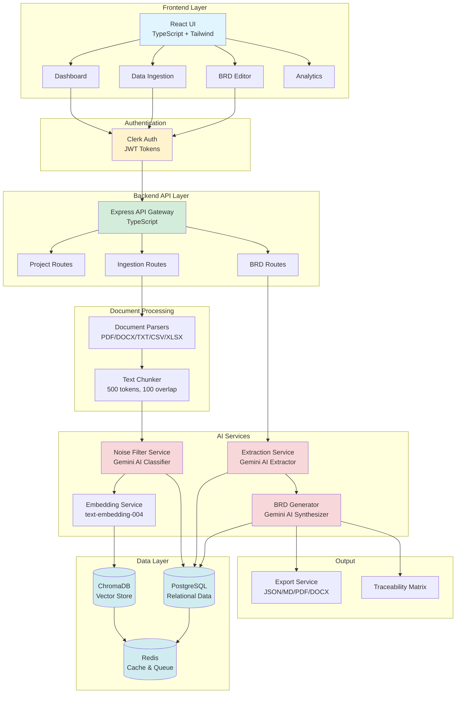
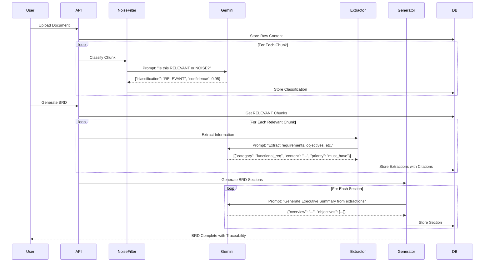
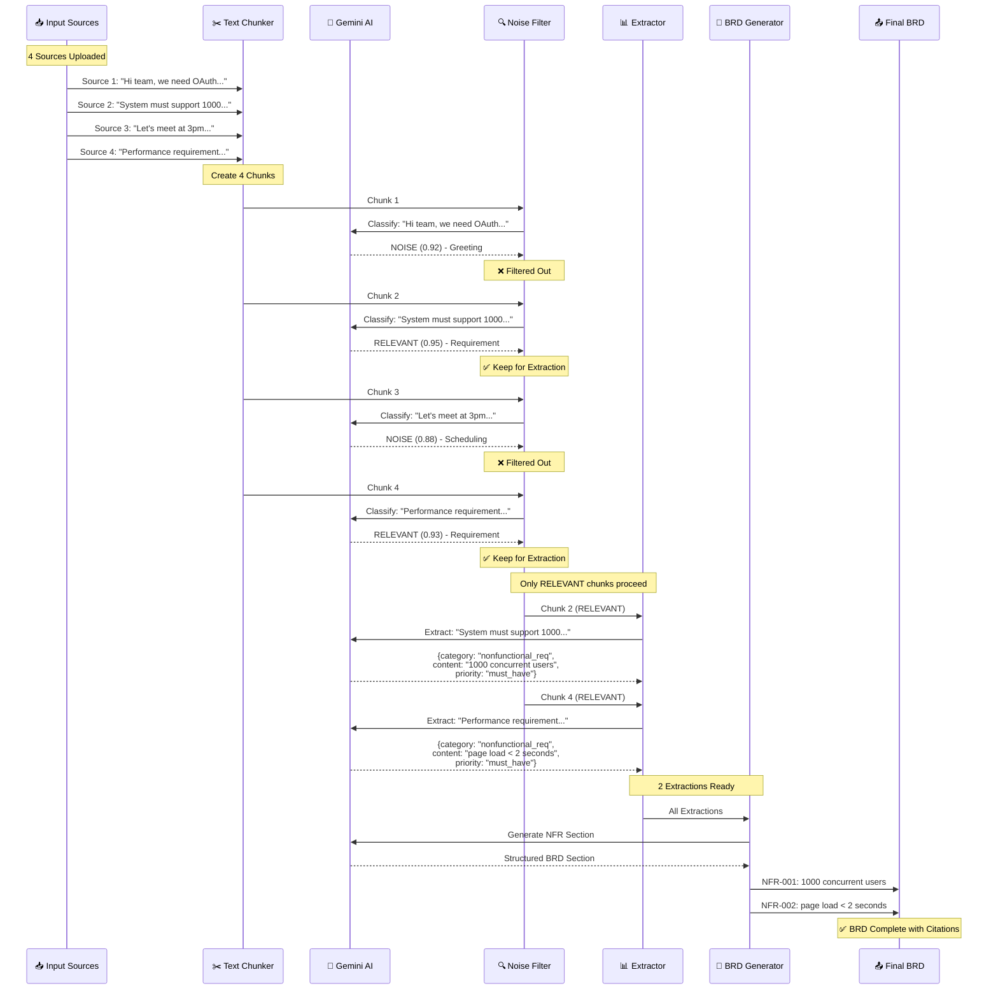
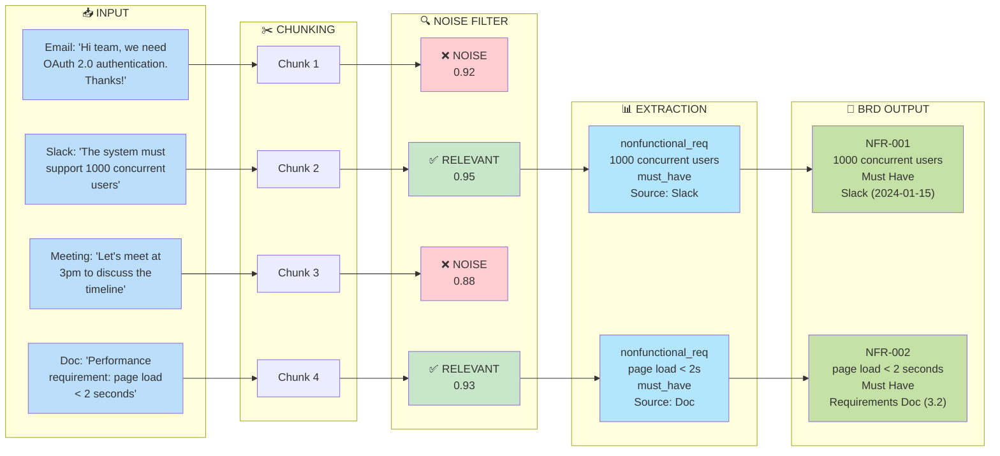

# AI-Powered BRD Generator - Project Overview

## 📋 Problem Statement

### The Challenge
Creating Business Requirements Documents (BRDs) is a time-consuming and error-prone process that involves:

1. **Information Overload**: Product teams receive requirements from multiple sources:
   - Email threads with scattered discussions
   - Slack conversations across different channels
   - Meeting transcripts from various stakeholders
   - Uploaded documents (PDFs, Word files, spreadsheets)
   - Manual notes and text inputs

2. **Manual Consolidation**: Business analysts spend hours:
   - Reading through hundreds of messages and documents
   - Filtering out irrelevant information (greetings, scheduling, casual chat)
   - Identifying and extracting actual requirements
   - Organizing information into structured sections
   - Tracking sources and maintaining traceability

3. **Inconsistency & Errors**:
   - Missing critical requirements buried in conversations
   - Duplicate or conflicting requirements from different sources
   - Lack of proper citation and traceability
   - Inconsistent formatting and structure
   - Version control challenges

4. **Time & Cost**:
   - Creating a comprehensive BRD can take 2-4 weeks
   - Delays project kickoff and development
   - High cost of manual labor
   - Frequent revisions and updates needed

### Business Impact
- Delayed project timelines
- Miscommunication between stakeholders
- Scope creep due to unclear requirements
- Increased development costs
- Poor project outcomes

---

## 💡 Our Solution

### AI-Powered BRD Generator Platform
A full-stack intelligent system that automates the entire BRD creation process using advanced AI and natural language processing.

### Key Features

#### 1. Multi-Source Data Ingestion
- **File Upload**: PDF, DOCX, TXT, CSV, XLSX with drag-and-drop
- **Manual Text Input**: Paste meeting notes or requirements directly
- **Integration Ready**: Slack, Gmail, Fireflies.ai connectors (architecture in place)
- **Flexible Input**: Handles unstructured data from any source

#### 2. Intelligent Noise Filtering
- **AI Classification**: Uses Google Gemini AI to classify each text chunk
- **Pattern Recognition**: Identifies greetings, scheduling, casual chat as NOISE
- **Relevance Scoring**: Assigns confidence scores (0-1) to each chunk
- **Smart Filtering**: Only processes RELEVANT content for requirements extraction

#### 3. Information Extraction
- **Category Detection**: Automatically identifies:
  - Functional Requirements
  - Non-Functional Requirements (performance, security, scalability)
  - Business Objectives
  - Stakeholders & Concerns
  - Timelines & Milestones
  - Risks & Assumptions
  - Decisions & Constraints
- **Priority Assignment**: MoSCoW prioritization (Must/Should/Could/Won't have)
- **Citation Tracking**: Links every requirement back to source documents

#### 4. Vector-Based Deduplication
- **Semantic Understanding**: Uses embeddings to detect similar requirements
- **Smart Merging**: Combines duplicate requirements and merges citations
- **Conflict Detection**: Identifies contradictory requirements from different sources

#### 5. Comprehensive BRD Generation
Generates a professional 12-section BRD:
1. Executive Summary
2. Business Objectives
3. Stakeholder Analysis
4. Scope (In/Out)
5. Functional Requirements
6. Non-Functional Requirements
7. Assumptions & Dependencies
8. Constraints
9. Risks & Open Questions
10. Success Metrics
11. Timeline & Milestones
12. Glossary

#### 6. Traceability & Export
- **Requirements Traceability Matrix (RTM)**: Links requirements to sources
- **Citation Viewer**: View original text snippets for any requirement
- **Export Formats**: JSON, Markdown, PDF, DOCX
- **Version History**: Track changes and maintain document versions

---

## 🏗️ System Architecture

### Technology Stack

**Frontend:**
- React 18 + TypeScript
- Vite (build tool)
- Tailwind CSS + Shadcn/ui components
- Zustand (state management)
- React Query (server state)

**Backend:**
- Node.js + Express + TypeScript
- Prisma ORM
- PostgreSQL (relational data)
- ChromaDB (vector embeddings)
- Redis (caching & queues)

**AI/ML:**
- Google Gemini Pro (gemini-1.5-pro)
- Google Text Embeddings (text-embedding-004)
- LangChain (AI orchestration)

**Infrastructure:**
- Docker Compose (local development)
- Clerk (authentication)

---

## 🔄 System Flow Diagrams

### High-Level Architecture Flow



### Detailed Processing Pipeline

```mermaid
flowchart TD
    Start([User Uploads Document]) --> Upload[Document Upload<br/>PDF/DOCX/TXT/CSV/XLSX]
    
    Upload --> Parse{Document Parser}
    Parse -->|PDF| PDFParser[PDF Parser<br/>pdf-parse]
    Parse -->|DOCX| DOCXParser[DOCX Parser<br/>mammoth]
    Parse -->|TXT| TXTParser[Text Parser]
    Parse -->|CSV/XLSX| SpreadsheetParser[Spreadsheet Parser]
    
    PDFParser --> RawText[Raw Text Content]
    DOCXParser --> RawText
    TXTParser --> RawText
    SpreadsheetParser --> RawText
    
    RawText --> StoreSource[Store in Source Table<br/>PostgreSQL]
    StoreSource --> Chunk[Text Chunking<br/>500 tokens, 100 overlap]
    
    Chunk --> ChunkLoop{For Each Chunk}
    
    ChunkLoop --> NoiseAI[Gemini AI<br/>Noise Classification]
    NoiseAI --> NoiseDecision{Classification?}
    
    NoiseDecision -->|NOISE| MarkNoise[Mark as NOISE<br/>confidence: 0.XX]
    NoiseDecision -->|RELEVANT| MarkRelevant[Mark as RELEVANT<br/>confidence: 0.XX]
    
    MarkNoise --> StoreChunk[Store Chunk<br/>PostgreSQL]
    MarkRelevant --> GenEmbed[Generate Embedding<br/>text-embedding-004]
    
    GenEmbed --> StoreVector[Store Vector<br/>ChromaDB]
    StoreVector --> StoreChunk
    
    StoreChunk --> MoreChunks{More Chunks?}
    MoreChunks -->|Yes| ChunkLoop
    MoreChunks -->|No| ProcessComplete[Processing Complete]
    
    ProcessComplete --> UserTrigger([User Clicks<br/>'Generate BRD'])
    
    UserTrigger --> GetRelevant[Get All RELEVANT Chunks<br/>from PostgreSQL]
    GetRelevant --> ExtractLoop{For Each Chunk}
    
    ExtractLoop --> ExtractionAI[Gemini AI<br/>Information Extraction]
    ExtractionAI --> ExtractCategories[Extract Categories:<br/>• Functional Requirements<br/>• Non-Functional Requirements<br/>• Objectives<br/>• Stakeholders<br/>• Timelines<br/>• Risks<br/>• Assumptions<br/>• Decisions]
    
    ExtractCategories --> StoreExtraction[Store Extraction<br/>with Citations<br/>PostgreSQL]
    StoreExtraction --> MoreExtractions{More Chunks?}
    
    MoreExtractions -->|Yes| ExtractLoop
    MoreExtractions -->|No| Dedupe[Deduplication Service]
    
    Dedupe --> VectorSearch[Vector Similarity Search<br/>ChromaDB]
    VectorSearch --> FindDupes{Similarity > 0.8?}
    
    FindDupes -->|Yes| MergeDupes[Merge Duplicates<br/>Combine Citations]
    FindDupes -->|No| KeepUnique[Keep Unique]
    
    MergeDupes --> ConflictCheck[Conflict Detection]
    KeepUnique --> ConflictCheck
    
    ConflictCheck --> BRDGen[BRD Generation Service]
    
    BRDGen --> GenSections{Generate 12 Sections}
    
    GenSections --> Sec1[1. Executive Summary<br/>Gemini AI]
    GenSections --> Sec2[2. Business Objectives<br/>Gemini AI]
    GenSections --> Sec3[3. Stakeholder Analysis<br/>Gemini AI]
    GenSections --> Sec4[4. Scope In/Out<br/>Gemini AI]
    GenSections --> Sec5[5. Functional Requirements<br/>Gemini AI]
    GenSections --> Sec6[6. Non-Functional Requirements<br/>Gemini AI]
    GenSections --> Sec7[7-12. Other Sections<br/>Gemini AI]
    
    Sec1 --> Combine[Combine All Sections]
    Sec2 --> Combine
    Sec3 --> Combine
    Sec4 --> Combine
    Sec5 --> Combine
    Sec6 --> Combine
    Sec7 --> Combine
    
    Combine --> SaveBRD[Save BRD to Database<br/>PostgreSQL]
    SaveBRD --> CreateRTM[Create Traceability Matrix<br/>Link Requirements to Sources]
    
    CreateRTM --> VersionControl[Version Control<br/>Save Snapshot]
    VersionControl --> Complete([BRD Ready])
    
    Complete --> ExportOptions{Export Format?}
    ExportOptions -->|JSON| ExportJSON[Export JSON]
    ExportOptions -->|Markdown| ExportMD[Export Markdown]
    ExportOptions -->|PDF| ExportPDF[Export PDF]
    ExportOptions -->|DOCX| ExportDOCX[Export DOCX]
    
    style Upload fill:#e1f5ff
    style NoiseAI fill:#ffe6e6
    style ExtractionAI fill:#ffe6e6
    style BRDGen fill:#ffe6e6
    style GenEmbed fill:#fff3cd
    style StoreVector fill:#d1ecf1
    style SaveBRD fill:#d4edda
    style Complete fill:#d4edda
```



### AI Processing Detail



### Data Model Relationships

```mermaid
erDiagram
    PROJECT ||--o{ SOURCE : contains
    PROJECT ||--o{ CHUNK : contains
    PROJECT ||--o{ EXTRACTION : contains
    PROJECT ||--|| BRD : generates
    PROJECT ||--o{ CONFLICT : detects
    
    SOURCE ||--o{ CHUNK : splits_into
    
    BRD ||--o{ BRD_VERSION : tracks
    
    PROJECT {
        string id PK
        string name
        string description
        string userId
        string status
        datetime createdAt
    }
    
    SOURCE {
        string id PK
        string projectId FK
        string sourceType
        string rawContent
        json metadata
        datetime ingestedAt
    }
    
    CHUNK {
        string id PK
        string projectId FK
        string sourceId FK
        string content
        json embedding
        boolean isRelevant
        float relevanceScore
        int chunkIndex
    }
    
    EXTRACTION {
        string id PK
        string projectId FK
        string category
        string content
        string priority
        json citations
        json metadata
    }
    
    BRD {
        string id PK
        string projectId FK
        int version
        json executiveSummary
        json functionalRequirements
        json nonFunctionalRequirements
        json rtm
        datetime createdAt
    }
    
    CONFLICT {
        string id PK
        string projectId FK


---


---

## 📊 Data Flow Example

### Complete Processing Journey

```mermaid
graph TB
    subgraph "INPUT: Multiple Sources"
        S1["📧 Source 1 (Email)<br/>'Hi team, we need OAuth 2.0<br/>authentication. Thanks!'"]
        S2["💬 Source 2 (Slack)<br/>'The system must support<br/>1000 concurrent users'"]
        S3["🎤 Source 3 (Meeting)<br/>'Let's meet at 3pm to<br/>discuss the timeline'"]
        S4["📄 Source 4 (Document)<br/>'Performance requirement:<br/>page load < 2 seconds'"]
    end
    
    subgraph "STEP 1: Text Chunking"
        C1["Chunk 1<br/>'Hi team, we need OAuth 2.0<br/>authentication. Thanks!'"]
        C2["Chunk 2<br/>'The system must support<br/>1000 concurrent users'"]
        C3["Chunk 3<br/>'Let's meet at 3pm to<br/>discuss the timeline'"]
        C4["Chunk 4<br/>'Performance requirement:<br/>page load < 2 seconds'"]
    end
    
    subgraph "STEP 2: AI Noise Filtering"
        N1["🚫 NOISE<br/>Confidence: 0.92<br/>Reason: Greeting + Thanks"]
        R1["✅ RELEVANT<br/>Confidence: 0.95<br/>Reason: Performance Requirement"]
        N2["🚫 NOISE<br/>Confidence: 0.88<br/>Reason: Scheduling"]
        R2["✅ RELEVANT<br/>Confidence: 0.93<br/>Reason: Performance Requirement"]
    end
    
    subgraph "STEP 3: Information Extraction"
        E1["📋 Extraction 1<br/>Category: nonfunctional_req<br/>Content: 'System must support<br/>1000 concurrent users'<br/>Priority: must_have<br/>Citation: Source 2, Chunk 2"]
        E2["📋 Extraction 2<br/>Category: nonfunctional_req<br/>Content: 'Page load time must be<br/>under 2 seconds'<br/>Priority: must_have<br/>Citation: Source 4, Chunk 4"]
    end
    
    subgraph "STEP 4: BRD Generation"
        BRD["📑 Generated BRD Section<br/><br/>Non-Functional Requirements<br/>━━━━━━━━━━━━━━━━━━━━━━<br/><br/>NFR-001: System must support<br/>1000 concurrent users<br/>Priority: Must Have<br/>Source: Slack (2024-01-15)<br/><br/>NFR-002: Page load time must be<br/>under 2 seconds<br/>Priority: Must Have<br/>Source: Requirements Doc (3.2)"]
    end
    
    S1 --> C1
    S2 --> C2
    S3 --> C3
    S4 --> C4
    
    C1 --> N1
    C2 --> R1
    C3 --> N2
    C4 --> R2
    
    N1 -.->|Filtered Out| Discard1[❌ Discarded]
    N2 -.->|Filtered Out| Discard2[❌ Discarded]
    
    R1 --> E1
    R2 --> E2
    
    E1 --> BRD
    E2 --> BRD
    
    style S1 fill:#e3f2fd
    style S2 fill:#e3f2fd
    style S3 fill:#e3f2fd
    style S4 fill:#e3f2fd
    
    style C1 fill:#fff9c4
    style C2 fill:#fff9c4
    style C3 fill:#fff9c4
    style C4 fill:#fff9c4
    
    style N1 fill:#ffcdd2
    style N2 fill:#ffcdd2
    style R1 fill:#c8e6c9
    style R2 fill:#c8e6c9
    
    style E1 fill:#b3e5fc
    style E2 fill:#b3e5fc
    
    style BRD fill:#c5e1a5
    
    style Discard1 fill:#f5f5f5
    style Discard2 fill:#f5f5f5
```

### Step-by-Step Sequence



### Detailed Data Transformation



---

## 🎯 Key Benefits

### For Business Analysts
- **90% time savings**: BRD creation from weeks to hours
- **Automated noise filtering**: No more manual reading of irrelevant messages
- **Complete traceability**: Every requirement linked to source
- **Conflict detection**: Automatically identifies contradictions

### For Product Managers
- **Faster project kickoff**: Immediate BRD availability
- **Better stakeholder alignment**: Clear, structured requirements
- **Version control**: Track changes and maintain history
- **Export flexibility**: Multiple formats for different audiences

### For Development Teams
- **Clear requirements**: Well-structured, categorized specifications
- **Traceability**: Understand the "why" behind each requirement
- **Reduced ambiguity**: AI-synthesized, consistent language
- **Acceptance criteria**: Clear definition of done

### For Organizations
- **Cost reduction**: Lower manual labor costs
- **Quality improvement**: Fewer missed requirements
- **Faster time-to-market**: Accelerated project timelines
- **Scalability**: Handle multiple projects simultaneously

---

## 📈 Project Status

### ✅ Completed Features
- Multi-format document parsing (PDF, DOCX, TXT, CSV, XLSX)
- Manual text input interface
- AI-powered noise filtering with confidence scoring
- Information extraction across 8 categories
- Vector-based deduplication
- 12-section BRD generation
- Citation tracking and traceability
- Export to JSON and Markdown
- Real-time processing statistics
- Version history management
- Authentication and authorization
- Responsive UI with dark/light themes

### 🚧 In Progress
- PDF and DOCX export functionality
- Natural language BRD editing
- Advanced conflict detection UI
- Analytics dashboard

### 🔮 Future Enhancements
- Gmail integration (OAuth)
- Slack integration (Bot API)
- Fireflies.ai integration (Meeting transcripts)
- Sentiment analysis
- Multi-language support
- Collaborative editing
- AI-powered requirement suggestions

---

## 🧪 Demo Workflow

1. **Create Project**: "E-Commerce Platform Redesign"
2. **Upload Documents**: 
   - Product requirements.pdf
   - Stakeholder emails.txt
   - Meeting transcript.docx
3. **Process**: Click "Start Processing"
   - 150 chunks created
   - 45 marked as NOISE (30%)
   - 105 marked as RELEVANT (70%)
4. **Extract**: Automatic extraction
   - 23 Functional Requirements
   - 12 Non-Functional Requirements
   - 5 Business Objectives
   - 8 Stakeholders identified
5. **Generate BRD**: Click "Generate BRD"
   - 12 sections created in 2 minutes
   - Full traceability maintained
6. **Export**: Download as Markdown or JSON

---

## 🔧 Technical Highlights

### AI/ML Innovation
- **Prompt Engineering**: Custom system prompts for each AI task
- **Few-Shot Learning**: Examples in prompts for better accuracy
- **Structured Output**: JSON schema enforcement for consistency
- **Confidence Scoring**: Transparency in AI decisions

### Performance Optimization
- **Chunking Strategy**: 500 tokens with 100 overlap for context
- **Batch Processing**: Process multiple chunks in parallel
- **Caching**: Redis for frequently accessed data
- **Vector Search**: Fast similarity detection with ChromaDB

### Scalability
- **Microservices Architecture**: Separate services for each function
- **Queue System**: BullMQ for background job processing
- **Database Optimization**: Indexed queries, connection pooling
- **Stateless API**: Horizontal scaling ready

### Security
- **Authentication**: Clerk-based secure auth
- **Rate Limiting**: Prevent API abuse
- **Input Validation**: Zod schemas for type safety
- **Error Handling**: Comprehensive error boundaries

---

## 📚 Learning Outcomes

### Technical Skills
- Full-stack TypeScript development
- AI/ML integration with LLMs
- Vector databases and embeddings
- Document parsing and NLP
- Real-time streaming (SSE)
- Docker containerization
- Database design and optimization

### Soft Skills
- Problem decomposition
- System architecture design
- API design and documentation
- User experience considerations
- Project planning and execution

---

## 🎓 Conclusion

The AI-Powered BRD Generator demonstrates how modern AI can transform tedious manual processes into automated, intelligent workflows. By combining document parsing, natural language processing, vector embeddings, and large language models, we've created a system that:

- **Saves time**: 90% reduction in BRD creation time
- **Improves quality**: Comprehensive, consistent, traceable requirements
- **Scales effortlessly**: Handle multiple projects and sources
- **Empowers teams**: Focus on strategy, not manual consolidation

This project showcases the practical application of cutting-edge AI technologies to solve real business problems, making it an excellent demonstration of full-stack development, AI integration, and product thinking.

---

## 📞 Questions?

Feel free to ask about:
- Technical implementation details
- AI model selection and prompt engineering
- Architecture decisions and trade-offs
- Future enhancement roadmap
- Deployment and scaling strategies
